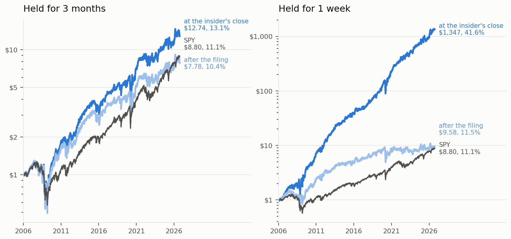
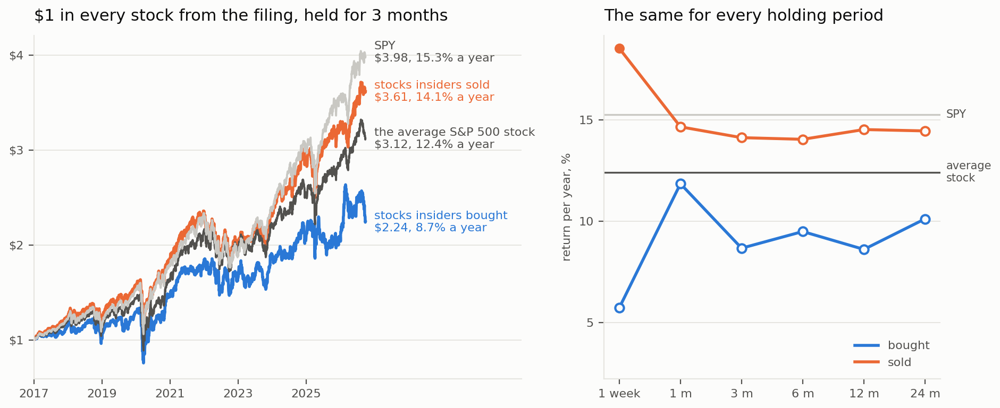

# What is an insider trade worth?

Report: [report/insider_trade_worth.pdf](report/insider_trade_worth.pdf)

When an insider in an S&P 500 company buys or sells his own stock, how well does he do, and how much of it is
left for someone who can only read the filing two days later?

Every open-market buy and sale by insiders in S&P 500 companies from 2006 to mid 2026 (SEC Form 4): 179,579
events, 168,013 of them in 774 companies with a price history. The stock is measured against SPY on two clocks: from the insider's own trade, and from
the first day after the filing, when anyone can act on it.



## What comes out

- Hold every stock for three months after an insider buys it, 2006 to 2026. Bought at the close on the insider's
  own trade day: 13.1% a year. Bought at the close after the filing: 10.4% a year. SPY: 11.1%. At three months
  the trade is worth 1.8% a year to the insider and nothing to anyone else, and neither is significant. The 1.8%
  is all from before 2017: since then the same portfolio has returned 11.9% a year against 15.3% for SPY.
- What the insider has is in the first days. Held for a week only, the same two portfolios return 41.6% and
  11.5% a year.
- Per trade: insiders buy after the stock has lost 3.4% to the market in a month. A week later it is 0.75% ahead
  (t = 6.3), after three months 1.4% (t = 1.6). CEOs 1.2% and 2.6%. The first week is there before and after 2017.
- Half of the first week comes before the filing, the other half on the day the market reads it. An outsider who
  buys at the next close gets 0.07% the first day, 0.5% after three months (t = 0.6), and nothing measurable out
  to two years once the beta of the stocks is taken out.
- Sales: the stock lags by 4.9% a year in the week after the sale on the insider's clock, most of it on the day
  the filing is read, and by nothing after that.
- After the filing, 2017 to 2026 on their own: the sign is the reverse of the textbook. Held for three months
  from the filing, the stocks insiders bought returned 8.7% a year and the ones they sold 14.1%, against 12.4%
  for the average S&P 500 stock. Neither gap is significant at three months (t = -1.4 and 1.6), so no signal to
  count on in either direction. Most likely momentum: insiders buy what has fallen and sell what has risen, and
  the test does not separate the two.
- In 2006-2016 an outsider still got 0.3% in the week after a buy (t = 2.7). That is gone.



Nobody outside can trade at the insider's close, and there are no trading costs in it, so the 41.6% is what the
information is worth when the trade is made.

## Run it

```
pip install -r requirements.txt
copy .env.example .env            # your name + email for the SEC, and a free Tiingo key
python src/ingest.py              # SEC insider data sets (82 zips, about 1 GB) + S&P 500 history -> data/trades.parquet
python src/prices.py              # Yahoo, then Tiingo for delisted names -> data/prices.parquet
python src/events.py              # events on both clocks, all horizons -> data/events.csv, issuer_days.csv
python src/analysis.py            # data/results.csv + figures/
python report/build_report.py     # report/insider_trade_worth.pdf
```

prices.py takes a few hours the first time, the free Tiingo tier allows 50 requests an hour. It can be stopped
and started again. Everything in data/ is rebuilt by the scripts and is not in git, except data/manual.

## How it is measured

- Event: one insider, one company, one filing day, one direction. On the public clock all insiders of a company
  on the same day are one signal.
- Per trade: total return of the stock minus SPY over 1 day, 1 week, 1, 3, 6, 12 and 24 months, with 3 months
  as the main one. t-values are clustered by month, and from three months up they allow for holding periods
  that overlap. Second benchmark: the equal-weighted S&P 500, the average stock.
- Every table is made for the whole sample and for 2006-2016 and 2017-2026 on their own (data/results.csv).
- As a portfolio: every day, all stocks with an insider buy (or sale) in the last week, month, three months ...,
  equal weight, daily returns compounded. One return per year for each clock, plus alpha and beta against SPY.
- A company counts if it was in the S&P 500 on the day of the filing (point-in-time members, fja05680/sp500).
- A price series is only used for a company in the years where the prices on its Form 4s follow the close
  (src/pricefit.py). Tickers get reused, this is what keeps another company's prices out.
- A stock that stops trading is followed to the end: deal price for a cash buyout, last price for a deal in
  shares, zero for a bankruptcy, then SPY (data/manual/delistings.csv, 145 companies, made by hand).
- Days with both buys and sales in the same company are flagged and shown on their own.

## Limits

- 6% of the events are in companies with no free price history (15% in 2006-2012, under 1% since 2020), among
  them several of the 2008 failures. That flatters the buys of the early years.
- Closing prices only. The outsider buys at the close the day after the filing. No trading costs.
- The insider's clock starts at the close of his trade day. His own price is about 0.1% better for buys.
- First Republic and Signature Bank filed with the FDIC, not the SEC, and are not in the data.
- S&P 500 only. Not looked at: 10b5-1 plans, option exercises, small companies.

## Forward test

```
python src/freeze.py              # writes forecasts/{month}/, commit it
python src/forward_test.py --label 2026-10      # later, on the filings that came after
```

## Files

```
src/config.py         paths, sample range, horizons, roles
src/ingest.py         SEC data sets -> trades of S&P 500 insiders, with role
src/prices.py         daily prices, Yahoo then Tiingo
src/pricefit.py       does this price series belong to this company
src/events.py         events, two clocks, returns, delistings
src/analysis.py       tables and charts
src/freeze.py         freeze the results
src/forward_test.py   the same test on later filings
report/build_report.py
data/manual/          cik_overrides.csv, delistings.csv
```

Data: SEC insider transactions data sets, github.com/fja05680/sp500, Yahoo Finance, Tiingo.
